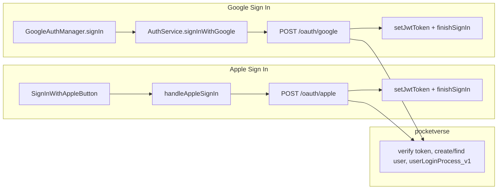

# Google and Apple Sign-in Enhancement

## Backend project

Backend lives at **[/Users/inseo/Documents/GitHub/pocketverse/pocketverse](/Users/inseo/Documents/GitHub/pocketverse/pocketverse)**. Auth routes are in `src/server/routes/index.js`; mobile signup routes are also in `src/server/app.js`. Base URL used by the app: `https://pocketverse.herokuapp.com/LS_API`.

---

## Current state

### iOS (fastblog)

- **AuthView** ([fastblog/Views/Auth/AuthView.swift](fastblog/Views/Auth/AuthView.swift)): Apple and Google buttons are **commented out** (“Hide Apple and Google for first launch”). Only “Continue with Email” is shown. Google button currently shows a “coming soon” alert.
- **AuthService** ([fastblog/Services/AuthService.swift](fastblog/Services/AuthService.swift)):
  - **Apple**: `handleAppleSignIn` builds an `AuthUser` and calls `finishSignIn` but **never calls the backend or sets a JWT**. Apple-signed-in users have no `currentJwtToken`, so any `requiresAuth: true` request fails.
  - **Email**: Signup/login call `/signup/mobile/local` and `/jwt_login_v1`, then `setJwtToken(token)` and `finishSignIn`.
- **GoogleAuthManager** ([fastblog/Services/GoogleAuthManager.swift](fastblog/Services/GoogleAuthManager.swift)): Google Sign-In SDK is wired; it does **not** create an `AuthUser` or call the backend.

### Backend (pocketverse)

- **POST /oauth/google** already exists in [pocketverse/src/server/routes/index.js](pocketverse/src/server/routes/index.js) (around line 6470):
  - Body: `{ idToken: string, userType?: "bloggo" }`.
  - Uses `verifyGoogleToken(idToken)` and `createUserFromGoogleProfile` or finds user by username and links Google; then calls `userLoginProcess_v1(user, user.username, res, isNewUser)`.
  - Response: same as `jwt_login_v1` — `{ message: "ok", token, user: signUserForResponse(userForClient), isNewUser }`. So the iOS app can call this and reuse the same JWT + user hydration as email login.
- **userLoginProcess_v1** (same file, ~line 794): Builds JWT with `jwt.sign({ userId: user._id })`, returns `{ message: "ok", token, user: signUserForResponse(...), isNewUser }`.
- **User model** ([pocketverse/src/server/models/user.js](pocketverse/src/server/models/user.js)): `signupType: 'local' | 'google' | 'facebook'`; `oauthProviders: { google: { id, email, refreshToken }, facebook: { id, email } }`. There is **no Apple** field or route yet.
- **POST /signup/mobile/facebook** in app.js returns only `{ result: 'success' }` (no JWT); the existing **POST /oauth/google** is the right pattern for mobile (token exchange returning JWT + user).

---

## 1. Backend (pocketverse) – Apple only (Google already done)

- **Add POST /oauth/apple** in [pocketverse/src/server/routes/index.js](pocketverse/src/server/routes/index.js), next to `/oauth/google`:
  - Body: `{ id_token: string, full_name?: string, userType?: "bloggo" }` (or match whatever the iOS client sends; `id_token` = Apple identityToken).
  - Verify the Apple identity token (decode JWT, verify signature with Apple’s public keys, check audience/bundle ID, optional nonce). Use a small library (e.g. `apple-signin-auth` or manual JWT verify with `https://appleid.apple.com/auth/keys`).
  - From decoded token: get `sub` (Apple user ID), `email` (may be null if user hid it). Use `full_name` from body for first-time signup if provided.
  - Find user by `oauthProviders.apple.id === sub` or by email if present; if none, create new user (username from email or generated from name, `signupType: 'apple'`, set `oauthProviders.apple: { id: sub, email }`), then call `userLoginProcess_v1(user, user.username, res, isNewUser)`.
  - Response: same as `/oauth/google` — `{ message: "ok", token, user: signUserForResponse(...), isNewUser }`.
- **User model** ([pocketverse/src/server/models/user.js](pocketverse/src/server/models/user.js)): Add `apple` to `signupType` comment and add `oauthProviders.apple: { id: String, email: String }` (same pattern as `google`/`facebook`).

---

## 2. iOS – Apple Sign In (backend exchange)

- In **AuthService** ([fastblog/Services/AuthService.swift](fastblog/Services/AuthService.swift)) `handleAppleSignIn`:
  - After a successful Apple credential, do **not** call `finishSignIn` immediately.
  - Read `cred.identityToken` (Data) and optionally `cred.fullName`; send to backend (e.g. POST `/oauth/apple`) with body like `{ "id_token": "<base64 string of identityToken>", "full_name": "<givenName familyName>", "userType": "bloggo" }`.
  - On success: `setJwtToken(response.token)`, build `AuthUser` from `response.user` (same shape as email login: `_id`, `email`, `username`, `name`, `storageUsedBytes`, `userLevel`), set `provider: .apple`, then `finishSignIn(user)`.
  - On failure: set `errorMessage`, `isLoading = false`.
  - Optional: add secure nonce to the Apple request and send it in the backend payload for server-side nonce verification.

---

## 3. iOS – Google Sign In (wire to existing backend)

- **Backend**: No change; use existing **POST /oauth/google** with body `{ idToken, userType: "bloggo" }`.
- **AuthService** ([fastblog/Services/AuthService.swift](fastblog/Services/AuthService.swift)): Add `signInWithGoogle(presenting: UIViewController?)` that:
  1. Sets `isLoading = true`, clears `errorMessage`.
  2. Calls `GoogleAuthManager.shared.signIn(presenting:)`. To get the result, extend **GoogleAuthManager** ([fastblog/Services/GoogleAuthManager.swift](fastblog/Services/GoogleAuthManager.swift)) so `signIn` accepts a completion handler `(Result<GIDGoogleUser, Error>) -> Void` and invoke it when sign-in finishes.
  3. On success: get `user.idToken?.tokenString`, call `APIManager.shared.post(endpoint: "/oauth/google", body: { idToken, userType: "bloggo" }, requiresAuth: false)`, then `setJwtToken(response.token)`, build `AuthUser` from `response.user` with `provider: .google`, and `finishSignIn(user)`.
  4. On failure or missing idToken: set `errorMessage`, `isLoading = false`.
- **Sign out**: In `AuthService.signOut()`, also call `GoogleAuthManager.shared.signOut()`.

---

## 4. AuthView – Show Apple and Google

- In [fastblog/Views/Auth/AuthView.swift](fastblog/Views/Auth/AuthView.swift): **Uncomment** the block with the Apple button, Google button, and “OR” divider.
- **Apple**: Keep `SignInWithAppleButton` and `authService.handleAppleSignIn(result:)` (which will now do backend exchange inside).
- **Google**: Replace the “coming soon” alert with calling `authService.signInWithGoogle(presenting: rootVC)`. Get `rootVC` the same way as GoogleAuthManager (e.g. `UIApplication.shared.connectedScenes` → key window → `rootViewController`), or pass `nil` and let GoogleAuthManager use its existing `rootViewController()`.
- Keep using `authService.isLoading` and `authService.errorMessage` for overlay and error alert.

---

## 5. Configuration and docs

- **Google**: [fastblog/docs/GOOGLE_OAUTH_SETUP.md](fastblog/docs/GOOGLE_OAUTH_SETUP.md) — ensure Info.plist has `GIDClientID` and URL scheme. Backend Google verification already uses `verifyGoogleToken` (google-auth-library).
- **Apple**: Add “Sign in with Apple” capability in Xcode. Backend will need Apple bundle ID and (for server verification) Apple Team ID, Key ID, and private key or use public key verification of the identity token.
- **Backend env**: Apple verification may require no extra env if using only identity token verification with Apple’s JWKS; document any required env (e.g. `APPLE_BUNDLE_ID`) in the backend repo.

---

## 6. Data flow (high level)

---

## 7. Implementation order

1. **Backend – Apple**: In [pocketverse/src/server/routes/index.js](pocketverse/src/server/routes/index.js) add `POST /oauth/apple`; in [pocketverse/src/server/models/user.js](pocketverse/src/server/models/user.js) add `oauthProviders.apple` and allow `signupType: 'apple'`.
2. **AuthService – Apple**: Add backend exchange in `handleAppleSignIn` (send identityToken to `/oauth/apple`, then set JWT and finishSignIn).
3. **GoogleAuthManager**: Add completion handler to `signIn(presenting:completion:)`.
4. **AuthService – Google**: Add `signInWithGoogle(presenting:)`, call backend `/oauth/google` with idToken, then set JWT and finishSignIn; in `signOut()` call `GoogleAuthManager.shared.signOut()`.
5. **AuthView**: Uncomment Apple/Google/OR block; wire Google to `signInWithGoogle(presenting:)`; remove “coming soon” for Google.
6. **Test**: Sign in with Apple and Google, then run an authenticated request (e.g. `/user/level`) to confirm JWT is sent and accepted.

---

## 8. Files to touch (summary)

| Area | File | Changes |
|------|------|--------|
| Backend | [pocketverse/src/server/routes/index.js](/Users/inseo/Documents/GitHub/pocketverse/pocketverse/src/server/routes/index.js) | Add `POST /oauth/apple` (verify Apple id_token, find/create user, call userLoginProcess_v1). |
| Backend | [pocketverse/src/server/models/user.js](/Users/inseo/Documents/GitHub/pocketverse/pocketverse/src/server/models/user.js) | Add `oauthProviders.apple: { id, email }`; allow `signupType: 'apple'`. |
| iOS | [fastblog/Services/AuthService.swift](fastblog/Services/AuthService.swift) | Apple: backend exchange + JWT before finishSignIn. Add signInWithGoogle(presenting:), exchange with /oauth/google, finishSignIn; signOut: call GoogleAuthManager.signOut(). |
| iOS | [fastblog/Services/GoogleAuthManager.swift](fastblog/Services/GoogleAuthManager.swift) | Add completion handler to signIn so AuthService can get GIDGoogleUser and idToken. |
| iOS | [fastblog/Views/Auth/AuthView.swift](fastblog/Views/Auth/AuthView.swift) | Uncomment Apple/Google/OR; wire Google to signInWithGoogle(presenting:); remove coming-soon alert. |
| Config | fastblog Info.plist, Xcode | GIDClientID, URL scheme; Sign in with Apple capability. |
