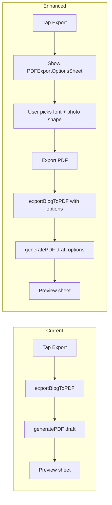

# PDF Export Styling Enhancement

## Current state

- **Text**: All PDF text uses `UIFont.systemFont(...)` in [PDFExportService.swift](fastblog/Services/PDFExportService.swift) (cover title 28pt bold, day header 20pt bold, place title 17pt semibold, body/captions 12–15pt). No serif or alternate styles.
- **Photos**: Single path — `drawSquarePhoto` and image helpers use `UIBezierPath(roundedRect:cornerRadius:)` with fixed radius (8 or 12). No circle or other shapes.
- **Flow**: Export is triggered from [RecapBlogPageView.swift](fastblog/Views/RecapBlogPageView.swift) via `exportBlogToPDF()` which calls `PDFExportService.generatePDF(from: draft)` with no options.

## 1. Text styling (more attractive fonts)

- Introduce a **font theme** that applies consistently across the PDF:
  - **Classic** (default): current system font — no behavior change.
  - **Serif**: Use a serif font (e.g. `UIFont(name: "Georgia", size:)` or Times New Roman) for a more editorial/print look. Apply to title, day headers, place titles, and body; keep badge/small labels in system if desired for clarity.
  - **Rounded**: Use system font with `.rounded` trait (e.g. `UIFont.systemFont(ofSize:weight:).withDesign(.rounded)` where available, or SF Rounded) for a friendlier look.
- In [PDFExportService.swift](fastblog/Services/PDFExportService.swift), replace hard-coded `UIFont.systemFont(...)` with a small helper that takes the theme and semantic role (e.g. title, heading, body, caption) and returns the appropriate `UIFont`. All existing call sites (cover, day header/caption, place card title/subtitle/story, photo captions, badge) will use this so the whole document is consistent.

## 2. Photo shape diversity

- Add a **photo shape** option:
  - **Rounded** (default): current behavior — rounded rect, existing corner radii.
  - **Circle**: Clip photos to an ellipse inscribed in the same bounding rect (using `UIBezierPath(ovalIn: rect)`). Same layout and spacing; only the clip path changes.
  - **Rectangle**: Sharp corners (cornerRadius 0) for a clean, minimal look.
- Implementation in [PDFExportService.swift](fastblog/Services/PDFExportService.swift):
  - Add a `PhotoShape` enum (e.g. `rounded`, `circle`, `rectangle`).
  - Refactor `drawSquarePhoto(_:in:cornerRadius:)` to something like `drawPhoto(_:in:shape:cornerRadius:)` and, in the single place that draws each photo, choose the clip path from `shape` (rounded rect vs oval vs rect). Apply the same shape to cover image and map snapshot where they use rounded rect today, for consistency (or limit to place-stop photos only, per product preference).
  - Keep layout and rect sizes unchanged; only the clipping path and optional radius vary.

## 3. User interaction: PDF options sheet

- **New model**: `PDFExportOptions` (e.g. in a new file or at top of PDFExportService):
  - `fontTheme: FontTheme` (e.g. `classic`, `serif`, `rounded`)
  - `photoShape: PhotoShape` (`rounded`, `circle`, `rectangle`)
  - `Codable` + `Equatable` with sensible defaults so it can be stored and passed around.
- **New UI**: `PDFExportOptionsSheet` (SwiftUI sheet, similar pattern to [StoryWritingStyleSheet.swift](fastblog/Views/StoryWritingStyleSheet.swift) / [BlogSettingsSheet.swift](fastblog/Views/BlogSettingsSheet.swift)):
  - Section “Font style” with picker or segmented control: Classic / Serif / Rounded (and short labels like “Clean”, “Editorial”, “Friendly”).
  - Section “Photo style” with picker: Rounded rectangles / Circles / Rectangles (and optional preview thumbnails if desired).
  - Primary button: “Export PDF” — dismisses sheet and triggers the actual export with the selected options.
  - Optional: “Use as default” (AppStorage) so next time the sheet opens with these selections pre-filled (or export could use defaults without showing the sheet when “Use as default” is on).
- **Export flow change** in [RecapBlogPageView.swift](fastblog/Views/RecapBlogPageView.swift):
  - When the user taps “Export” (or “Export as PDF Instead”), present `PDFExportOptionsSheet` instead of calling `exportBlogToPDF()` immediately.
  - Sheet is bound to optional `PDFExportOptions` (e.g. from AppStorage default or last used). On “Export PDF”, dismiss and call `exportBlogToPDF(options: selectedOptions)`.
  - `exportBlogToPDF(options:)` sets `isExportingPDF = true`, then calls `PDFExportService.generatePDF(from: draft, options: options)` and on success shows `PDFPreviewSheet` as today.
- **Service API**: Extend `PDFExportService.generatePDF(from:)` to `generatePDF(from:options:)` with default `options: PDFExportOptions()`. Pass `options` into the render closure and into `Pen`; use `options.fontTheme` for all font resolution and `options.photoShape` wherever photos are drawn.

## 4. File and dependency summary

| Area          | Files to add                                                      | Files to modify                                                                            |
| ------------- | ----------------------------------------------------------------- | ------------------------------------------------------------------------------------------ |
| Model         | Optional: `PDFExportOptions.swift` or define in existing PDF file | —                                                                                          |
| Options UI    | `PDFExportOptionsSheet.swift`                                     | —                                                                                          |
| Export flow   | —                                                                 | `RecapBlogPageView.swift` (show sheet, pass options, call new API)                         |
| PDF rendering | —                                                                 | `PDFExportService.swift` (options param, font helper, photo shape in draw methods and Pen) |

## 5. Optional enhancements (later)

- Per-photo shape override (e.g. “circles for this card only”) — would require options stored per stop or per photo; can be skipped for v1.
- Additional font themes (e.g. “Modern” with a different system style) once the theme pipeline exists.
- “Save as default” for options so returning users get one-tap export with their preferred look.

## Flow diagram

No change to [BlogPDFView.swift](fastblog/Views/BlogPDFView.swift) or [PDFPreviewSheet.swift](fastblog/Views/PDFPreviewSheet.swift) is required for this enhancement; the actual PDF is generated only in `PDFExportService` with `UIGraphicsPDFRenderer`.